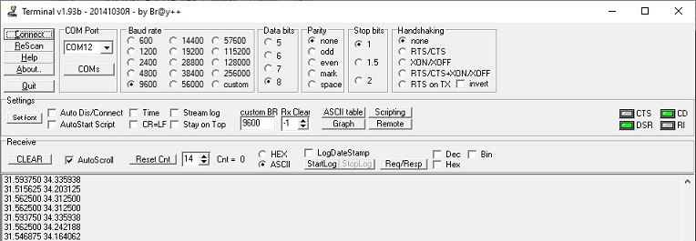

## STM32F302C8T6

Термопаара (термоэлектрический преобразователь) — устройство в виде пары проводников из различных материалов, соединённых на одном конце и формирующих часть устройства, использующего термоэлектрический эффект для измерения.

**MAX31856MUD**	- Precision Thermocouple to Digital Converter with Linearization

**TMP112AIDRLR** - Digital Temperature Sensors

UART to USB
